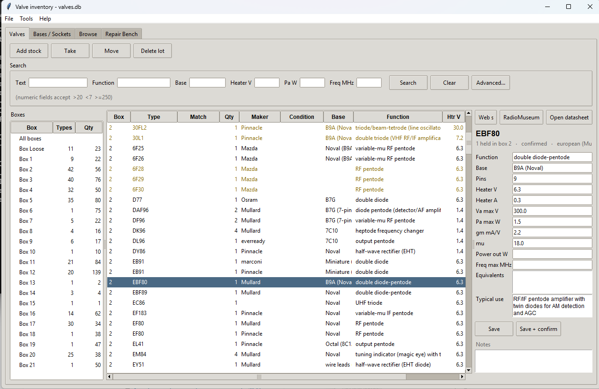
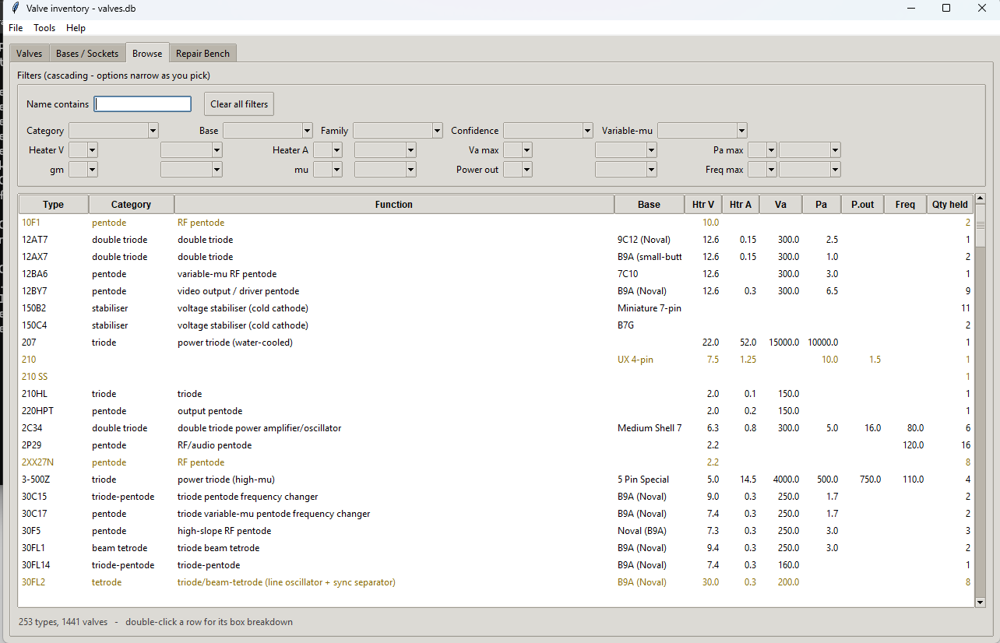
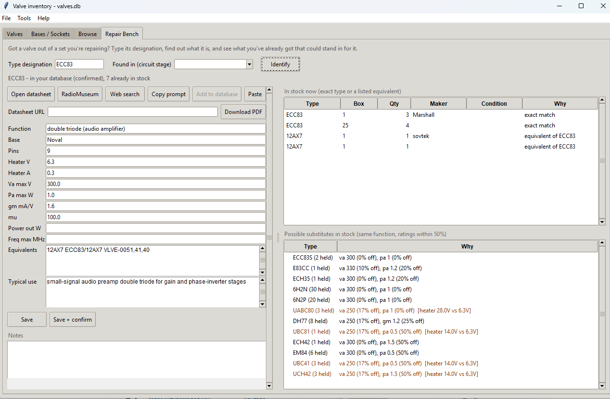

# Valve inventory

A SQLite database and command-line tool for the attic collection.
**1,441 valves · 253 types · 36 boxes**, converted from the 38-tab spreadsheet
(a handful of duplicate/dual-marked entries have since been merged).

## History

I built this to catalogue my own valve (vacuum tube) collection, previously
tracked across a 38-tab spreadsheet that had outgrown what a spreadsheet
could usefully do — particularly parametric search ("what output pentodes
over 20W do I have?"). The database that ships with this repository
(`data/`, restored into `valves.db`) **is my actual stock**: real box
locations in my attic, not sample data.

If you're here for your own collection rather than mine, that's exactly
what this tool is for too — see
[Starting your own collection](#starting-your-own-collection) below, and
the same walkthrough in the Installation Manual (`docs/INSTALLATION_MANUAL.pdf`).

## License, warranty, and risk

MIT-licensed — see [LICENSE](LICENSE). MIT is about as permissive as
licenses get; its one real obligation, keeping the copyright notice
attached, is also what gives it attribution. (The data in `data/` carries
its own, separate note in `LICENSE` — some of the descriptive text there is
third-party material gathered from reference sites, not mine to relicense.)

**This software is provided without warranty of any kind, express or
implied, and you use it entirely at your own risk.** It's hobbyist tooling
built for one person's attic, not a certified reference — treat every
`inferred` parameter as a lead to verify against a real datasheet, not a
settled fact, especially before relying on it for anything involving the
lethal voltages a valve amplifier runs at.

By downloading, installing, or running this application, you're confirming
that you've reviewed the source for yourself — it's a modest, readable
Python codebase, with no network access beyond what's documented
(`fetch_datasheets.py`, the optional Claude-research workflow, and PyPI for
the two optional dependencies) — and that you accept these terms.

## Community

This started as a fix for one person's attic, but the parametric search,
the naming-convention classifier, and the Claude-assisted research/datasheet
workflows are useful to anyone cataloguing valves. The hobbyist tube
community has always run on people writing down what they know for the next
person — a datasheet rescued from a defunct site, a base wiring diagram
redrawn from memory, a substitution someone actually tried. If this is
useful to you, bug reports, pull requests, and researched-parameter
contributions are all welcome; if you extend it for a different kind of
collection, I'd like to hear about it.

## Files

| File | What it is |
|---|---|
| `valves.db` | The database. This is the only file that matters — back it up. |
| `valves.py` | The command-line tool. |
| `valves_gui.py` | The desktop window. Same database, different way in. |
| `run.bat` | Windows: double-click to launch the desktop window without opening a terminal first. |
| `valvelib.py` | Schema, type-name normalisation, and the code classifier. |
| `build_db.py` | One-off converter from the original workbook. Already run. |
| `fetch_datasheets.py` | Builds the local datasheet archive. |
| `snapshot.py` | Writes the diffable text snapshot in `data/` for version control. |
| `test_smoke.py` | Quick self-check that the pieces still fit together. |
| `data/` | Committed text snapshot of the collection. |
| `valve_inventory.xlsx` | Spreadsheet snapshot, regenerate any time with `export`. |
| `upload_template.csv` | Column layout for bulk-adding stock — `import-csv` / Tools > Import upload CSV. |
| `import_researched.py` | Applies a research assistant's reply back into the database — see "Filling in the reference data" below. |
| `QUICKSTART.md` | Standalone install/use walkthrough, bundled into `Export archive and tools`. |
| `docs/` | The four PDF manuals (Installation, User, Technical, Upgrade) and `build_manuals.py`, which regenerates them. Also linked from the GUI's Help menu. |

Requires Python 3.8+. `openpyxl` is only needed for export; `tkinter` only for the
GUI — on most systems it ships with Python, but Debian and Ubuntu split it out
into `python3-tk`. `reportlab` is only needed to regenerate the PDF manuals in
`docs/` (`python3 docs/build_manuals.py`).

## The window

```bash
python3 valves_gui.py
```

Both front ends read and write the same `valves.db`, so use whichever suits the
moment — the GUI for browsing and filling in datasheet figures, the CLI for
quick lookups and scripting. Five tabs:

### Valves



- **Boxes down the left** — click a heading to sort, click a box to filter,
  "All boxes" to clear.
- **Search row** — text, function, base, and the numeric fields, taking the
  same `>20` / `<7` / `>=250` comparisons as the CLI. Text searches the lot's
  own fields as well as the reference record, so "the one out of the Bush" or
  a number printed only on the glass finds it without your having to remember
  which field you wrote it in. Searching a type by name
  also pulls in stock of anything cross-referenced as its equivalent (shown
  in blue, labelled which type it's equivalent to) — search `ECF80` and you'll
  see `PCF80` stock too. **Advanced...** opens every field — maker, condition,
  family, confidence, has-datasheet, position, origin, Type 1 / Type 2, and
  the rest of the numeric ratings.
- **Results table** — click a heading to sort, double-click a row to open its
  datasheet. **Amber rows are unconfirmed (inferred); blue rows are
  equivalents pulled in by a search.**
- **Panel on the right** — the type's reference record, editable in place.
  *Save* keeps it inferred; *Save + confirm* marks it confirmed and the row
  turns black — that amber-to-black transition is the progress bar for
  working through the collection. Below it, **Similar types** lists other
  held types with the same function and every shared electrical rating within
  50% — not equivalents, just plausible substitutes with modification (heater
  mismatches are flagged, not filtered out, since a dropping resistor or a
  different supply can usually cover that). Double-click one to look it up.
  *Open datasheet* / *RadioMuseum* / *Web search* look up whatever's
  selected — the button reads **Open datasheet (local)** or **Find
  datasheet (web)** so you know which one it'll do before clicking. *Manage...*
  (labelled *Manage information...* on the Browse tab's popup) opens a
  type's full document list: the one "primary" sheet that button opens,
  plus as many extra datasheets and links as you want (a second
  manufacturer's sheet, a forum thread, a project that happens to use this
  valve) — upload a file you already have, or just paste a URL. Its
  *Edit parameters...* button opens the same field-entry form as the detail
  panel, so a Browse-tab research session never needs to switch tabs to
  record what a datasheet says.
- **Add stock / Edit lot / Individual valves… / Take / Move / Delete lot** act
  on the selected row. *Add stock* creates the type automatically if it's new,
  classifying it as it goes. *Edit lot* changes everything recorded against
  that one physical lot — where it sits, what it's marked as, where it came
  from (see [What a lot records](#what-a-lot-records)). *Individual valves…*
  opens the per-valve view: which valve sits where, what each is marked with,
  and what each one measured (see
  [Individual valves and testing](#individual-valves-and-testing)). The two
  editors do different jobs: *Edit lot* is this batch of valves, the panel on
  the right is the reference record shared by every lot of that type.

### Bases / Sockets

Same idea as the Valves tab, for the sockets/bases themselves rather than the
valves that plug into them — tracked separately since they're not valves.

### Browse



A parametric filter: dropdowns for function/base/family/confidence and
operator+value pickers (`<` `=` `>`) for every numeric rating, all cascading —
picking one narrows what the others offer. A name filter narrows the list as
you type (`3cx`, `PL`, whatever). Click a heading to sort; double-click a
type for a popup showing exactly which boxes hold it and how many in each.

### Repair Bench



For "I've got this valve out of a set I'm fixing — what is it, and what have
I got that could stand in for it?" Type the designation (and optionally which
circuit stage it came from), *Identify*.

If it's already in your database, its reference data loads straight in, **In
stock now** shows anything you hold of that exact type or a listed
equivalent, and **Possible substitutes** lists other held types with the same
function and every shared rating within 50% — the Valves tab's Similar-types
logic, scoped to what's actually in stock. Double-click a substitute to
switch the bench to it.

If it's new to you, *Open datasheet* / *RadioMuseum* / *Web search* work
immediately off the typed name, and *Copy research prompt* puts a
single-type research prompt on the clipboard (same block format Apply
researched data... expects). *Add to database* creates a bare reference
record so there's somewhere to save what you find; *Save* / *Save + confirm*
work exactly as the Valves tab detail panel and immediately refresh the
substitute list with whatever you just entered.

### Docs

General reference material that isn't about one specific type — a
care-and-feeding guide, a base wiring reference, whatever's worth keeping
alongside the collection. *Add from file...* copies a PDF you already have
into the local archive; *Add from URL...* just records a link. Title and an
optional abstract for each; the abstract shows in the pane on the right when
you select a document, and a filter box narrows the list as you type.

### Tools menu

Collection summary, what still needs data, duplicate candidates, scanning the
datasheet archive; a blank upload template, CSV import, and a CSV-building
prompt for turning someone's own messy records into an import (see "Keeping
it current" below); and the two research-prompt workflows (see "Filling in
the reference data" below) — one for electrical parameters, one for pulling
missing datasheet PDFs into the local archive. **File > Export archive and
tools** zips up the tools, docs, and a fresh snapshot for handing the whole
thing to someone else — see `QUICKSTART.md`.

### Help menu

A task-by-task **User guide** covering all of the above, plus links to open
the four PDF manuals in `docs/` (Installation, User, Technical, Upgrade) in
whatever PDF viewer is installed.

Merging duplicate types is command-line only, deliberately: it rewrites stock
rows and is not something to do by mis-click.

## Structure

Two tables, as discussed:

- **`valve_type`** — one row per type. Function, base, heater V/A, Va, Pa, gm, μ,
  power out, frequency, equivalents, and the path to its datasheet in the local archive.
- **`stock`** — one row per lot. Type, box, position, quantity, manufacturer,
  condition, Type 1 / Type 2, origin, test values, other, notes.
- **`valve`** — one row per individually-tracked physical valve, belonging to a
  lot. Its own position, serial/date code, maker, condition.
- **`valve_test`** — one row per test of one valve, or of one section of it.

Plus `sundry` for the sockets, screening cans and crystals, and `box` for
per-box location notes.

### What a lot records

A lot is one physical batch: this many of this type, in this box. Two Mullard
EL84s out of different sets are one *type* but two *lots*, and it's the lot
that knows which shelf it's on and which set it came out of. Beyond quantity,
manufacturer and condition, each lot carries:

| Field | What goes in it |
|---|---|
| `position` | Where in the box it sits, as a grid reference — `B-12`, row and column. |
| `type1` / `type2` | Other designations the valve is marked with: a US number, a service code, a second maker's part number. Searchable, so it doesn't matter which one you look it up by. |
| `origin` | Where it came from — bought, inherited, or the set it came out of. |
| `test_values` | What it measured on a tester. |
| `other` | Anything else: boxed or unboxed, odd printing, whatever the row needs. |

**Every one of them is optional**, and blank is a perfectly normal value — the
tool behaves exactly as it did before they existed for anyone who doesn't
want them. Fill them in from *Add stock*, from *Edit lot* afterwards, from the
upload CSV, or from `valves.py add` / `valves.py edit`. On the command line a
listing leaves out any of these columns that's empty for every row it shows,
so `valves.py box 12` looks exactly as it always did until there's something
in there to show.

Upgrading an existing database needs no migration step of your own: opening
it with this version adds the columns in place, leaving every value already
there untouched. See `docs/UPGRADE_GUIDE.pdf`.

### Individual valves and testing

A lot is a quantity — "6 x KT66 in box 8" — and for most of a collection
that's all it ever needs to be. Where it isn't, **expand** the lot: that
creates one row per valve held, in the `valve` table, and from then on each
valve is a thing in its own right with its own position on the shelf, its own
serial or date code, its own maker and condition (for a mixed lot), and its
own test history.

```bash
python3 valves.py expand 417            # 6 x KT66 becomes 6 valve rows
python3 valves.py lot 417               # which valve is where, and what it measured
python3 valves.py valve 22 --position B-01 --serial 'AJ3 K7'
```

Expanding is opt-in per lot, and safe to re-run — it only ever tops a lot up.
`valves.py add` expands a new lot straight away (pass `--no-individual` to
skip); `import-csv` doesn't unless you pass `--individual`, since a bulk
import is exactly where a few hundred rows become a few thousand. In the GUI
it's *Individual valves…* → *Track individually*, and the **Ind** column on
the results table shows how many of each lot are tracked.

#### What a test records

Each test is a row in `valve_test`, and **testing is never destructive** — a
retest years later adds to the history rather than replacing it. Every reading
is optional, because no single tester produces all of them: an emission tester
gives one figure, an AVO VCM163 reads anode current and mutual conductance on
two meters at once plus separate gas and insulation tests, a curve tracer
gives everything.

| | Field | Units |
|---|---|---|
| **Conditions** | `tested_on`, `tester` | |
| | `va`, `vg` | V — a gm figure means nothing without them |
| | `bias_mode` | fixed / auto — the same valve reads differently under each |
| **Readings** | `ia` anode (plate) current | mA |
| | `ig2` screen current | mA |
| | `gm` mutual conductance | **mA/V** (× 1000 for the µmhos a US tester shows) |
| | `gm_pct` | % of nominal — how valves are actually graded |
| | `emission_pct` | % |
| **Fault tests** | `gas_ua` gas / grid current | µA |
| | `insulation_mohm` | MΩ |
| | `heater_cathode` | MΩ or pass/fail |
| | `shorts`, `verdict` | pass/fail, good/weak/short/failed |

```bash
python3 valves.py test 22 --gm 6.2 --ia 36 --tester 'AVO VCM163' \
                          --va 250 --vg -14 --gas-ua 2 --verdict good
python3 valves.py tests 22               # every test of that valve, newest first
```

**A double triode is recorded a section at a time** — run `test` twice, once
with `--section a` and once with `--section b`. That's how the readings come
off the meter, and comparing the two is the whole point of testing one for
phase-inverter duty. Listings show the most recent test of either section;
the history shows both.

#### Quantity and individuals stay in step

`stock.qty` remains the authoritative count. `take` removes that many
individual rows too — **least documented first**, untested before tested,
unmarked before serial-numbered — so using valves up never quietly discards
test history you took the trouble to record. Deleting a lot removes its
valves and their tests with it. `valves.py check` (Tools > Check individual
valve counts) reports any lot where the two have drifted apart; it reports
rather than corrects, because which side is right depends on what's actually
in the box.

## Version control

The database is binary, so `valves.db` is gitignored and a text snapshot is
committed instead. Refresh it before you commit:

```bash
python3 snapshot.py          # writes data/*.csv (types, stock, valves, tests, ...) + valves.sql
git add -A && git commit -m "restocked box 12"
```

`snapshot.py` opens the database through the same schema check the app uses,
so an older one is brought up to date before it's written out — the snapshot
always matches the schema the code expects.

After cloning on another machine:

```bash
python3 snapshot.py --restore    # rebuilds valves.db from data/valves.sql
python3 test_smoke.py            # confirms everything fits together
```

The CSVs are what git will show you diffs in — you get a readable history of
what changed in the collection, which a committed `.db` would not give you.
`valves.sql` is the full dump that `--restore` rebuilds from.

## Starting your own collection

The database that ships here is mine. To make it yours:

**Option A — start empty.** Delete the working database and launch the app;
a fresh, empty one is created automatically:

```bash
rm valves.db          # del valves.db on Windows
python3 valves_gui.py
```

**Option B — keep the reference library, clear the stock.** The 253
researched valve types (function, base, heater, ratings) are useful on
their own regardless of whose valves they are — keep that, wipe out my
boxes and quantities:

```bash
python3 -c "
import valvelib as V
con = V.init_db()
for t in ('valve_test', 'valve', 'stock', 'socket', 'sundry', 'box'):
    con.execute(f'DELETE FROM {t}')
con.commit()
n = con.execute('SELECT COUNT(*) FROM valve_type').fetchone()[0]
print('cleared - kept', n, 'reference types')
"
```

Either way, run `python3 snapshot.py` afterward if you want your own fork's
`data/` to reflect the change before committing.

## Command line

```bash
python3 valves.py box 12                  # what's in box 12
python3 valves.py find KT66               # which boxes hold KT66
python3 valves.py show ECC83              # full reference record
python3 valves.py stats                   # collection summary
python3 valves.py docs --type EL34        # a type's datasheet + extra links
python3 valves.py docs                    # the general reference library
python3 valves.py lot 417                 # a lot's individual valves and their tests
python3 valves.py tests 22                # one valve's test history

# parametric search - this is the part the spreadsheet couldn't do
python3 valves.py search --function "output pentode" --heater 6.3
python3 valves.py search --pa '>20'                 # anode dissipation over 20W
python3 valves.py search --function triode --freq '>100'
python3 valves.py search --text nuvistor
python3 valves.py search --maker Mullard --box 5

# the per-lot fields
python3 valves.py search --position B-           # everything on row B
python3 valves.py search --origin 'Bush'         # what came out of the Bush
python3 valves.py search --alt 6BQ5              # marked 6BQ5, filed under EL84
```

Comparison operators work on `--heater --pa --va --freq --gm --mu`:
`'>20'`, `'<7'`, `'>=250'`, or a bare number for exact match. Quote them so the
shell doesn't read `>` as a redirect.

## Keeping it current

```bash
python3 valves.py add EL84 --box 25 --qty 6 --maker Mullard --condition NOS \
                           --position B-12 --type1 6BQ5 --origin 'ex Bush DAC90'
python3 valves.py take EL84 --qty 2                  # used two in a build
python3 valves.py move GZ34 --frm 8 --to 12 --position A-01
python3 valves.py edit 417 --position C-04 --test 'gm 9.8 mA/V'
python3 valves.py export                             # refresh the xlsx
```

`add` creates the type automatically if it's new, classifying it from its
designation as it goes, and reports the lot id it created. `edit` takes that
id — also the `ID` column of `box`, `find` and `show` — and changes one lot in
place: only the options you pass are written, and `--origin ''` clears a field
you filled in by mistake. For a whole batch at once, use `import-csv` (or
Tools > Import upload CSV in the GUI) with a file shaped like
`upload_template.csv` — same auto-classification, one row per lot. Only
`type` and `box` are required there; any other column can be left blank or
left out of the file altogether, so a CSV written for an older version still
imports unchanged. Tools >
Create upload template writes a blank copy of that CSV ready to fill in; if
your existing records aren't already in that shape, Tools > Generate
CSV-building prompt writes a prompt for any Claude chat that interviews you
(or reads whatever spreadsheet, notes, or photos you describe) and hands back
a ready-to-import CSV.

## Filling in the reference data

Parameters start out **inferred from the type designation** — a guess, not a
datasheet reading. Types are marked `inferred` until confirmed, either by hand:

```bash
python3 valves.py set EL34 --pa 25 --va 800 --gm 11 --mu 11 \
                           --base octal --pins 8 --power-out 25 --confirm
```

or by handing the gap list to a research assistant. In the GUI, Tools >
Generate research prompt... writes a ready-to-paste prompt (same one described
above, aimed at your highest-quantity unconfirmed types) into a text file.
Paste it into Claude, save the reply, then Tools > Apply researched data...
(or `python3 import_researched.py <file> --yes` from the command line) writes
back only what was actually confirmed — a hedged finding ("could not verify",
"plausible") is kept as a lead rather than marked `confirmed`.

Missing the datasheet PDF itself, rather than just the parameters? Tools >
Generate datasheet download prompt... writes a prompt aimed at an agent with
file *and* web access (Claude Code, not a plain chat, since it needs to write
files to disk) — it tries `fetch_datasheets.py` first, then searches further
for whatever's still missing and saves PDFs straight into the local archive.

`--confirm` flips a record to `confirmed`. `python3 valves.py gaps` lists what
still needs attention, ordered by how many you actually hold — so the effort
goes where it's worth spending.

Current coverage: **201 of 253** types are `confirmed`, **243** have a
function and **227** a heater rating. The rest are one-offs and rare types
the naming conventions and the usual archives don't cover.

## The datasheet archive

Three stages, and stages 1–2 want to run overnight:

```bash
python3 fetch_datasheets.py --index      # map the site (slow, resumable)
python3 fetch_datasheets.py --download   # pull only types you hold
python3 valves.py scan                   # link the files into the database
```

Then `python3 valves.py sheet EL34 --open` opens the PDF.

It fetches **only your 258 types and their equivalents**, not the whole site —
smaller download, and much kinder to a server that runs on donations. The default
2-second delay between requests is deliberate; please don't lower it. Both stages
resume if interrupted, so Ctrl-C is safe.

I couldn't verify Frank's exact directory layout when writing this (no network
access to that host from where it was built), so the crawler discovers the
structure rather than assuming it. If stage 1 comes back with very few hits, the
site layout has changed — the mirrors listed on its index page are the fallback.

For parameters rather than PDFs, `https://tdsl.duncanamps.com/show.php?des=EL34`
gives tabulated figures for filling in `set`, and there's a downloadable offline
edition.


  blank type cell (Box 23, 24, 26), the text was appended to the type's notes.
- **Heater codes** — `30` in a Mazda designation is read as 300 mA series-chain
  current, not volts, so those types have `heater_a` rather than `heater_v`.
